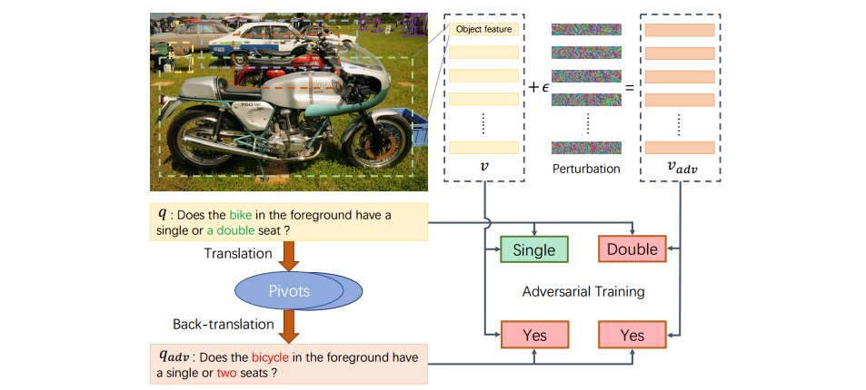

# Semantic Equivalent Adversarial Data Augmentation for Visual Question Answering-Pytorch

#### *Working in Progress*

This repository corresponds to the ECCV 2020 paper *Semantic Equivalent Adversarial Data Augmentation for Visual Question Answering*.



## Dependencies

You may need at least **1 GPU** with **11GB memory**  for training, and **200GB free disk space** for storing VQAv2 dataset. We strongly recommend to use a SSD drive to guarantee high-speed I/O.

- Python 3.6
  - pytorch > 0.4
  - torchvision 0.2
  - h5py 2.7
  - tqdm 4.19

## Installation

1. ```
   git clone https://github.com/zaynmi/seada-vqa.git
   ```

2. We recommend to install everything in an Anaconda environment.

   ```
   conda create -n seada python=3.6
   source activate seada
   ```

3. Install Pytorch 1.0 and torchvision 

   ```
   conda install pytorch=1.0 torchvision cudatoolkit=10.0 -c pytorch
   ```

4. Install other dependencies as follows:

   ```
   pip install -r requirements.txt
   python -m spacy download en
   ```

5. Install [OpenNMT-py](https://github.com/OpenNMT/OpenNMT-py) for generating paraphrases, it allows to install `onmt` package in your environment: 

   ```
   git clone https://github.com/zaynmi/OpenNMT-py.git
   cd OpenNMT-py
   python setup.py install
   cd ..
   ```

6. Download and unpack [the translation models](https://drive.google.com/open?id=1b2upZvq5kM0lN0T7YaAY30xRdbamuk9y) into the `seada/sea/translation_models` folder. You'll get four `.pt` models.

## Prepare Dataset (Follow [Cyanogenoid/vqa-counting](https://github.com/Cyanogenoid/vqa-counting))

- In the `data` directory, execute `./download.sh` to download VQA v2 and the bottom-up-top-down features.
- Prepare the data by running

```
python data/preprocess-features.py
python data/preprocess-vocab.py
```

This creates an `h5py` database (95 GiB) containing the object proposal features and a vocabulary for questions and answers at the locations specified in `config.py`.

## Training

### Step 1: Generating the paraphrases of questions


### Step 2: Adversarial training


## License

The code is released under the [MIT License](https://github.com/zaynmi/semantic-equivalent-da-for-vqa/blob/master/LICENSE)

## Citing

If this repository is helpful for your research, we'd really appreciate it if you could cite the following paper: